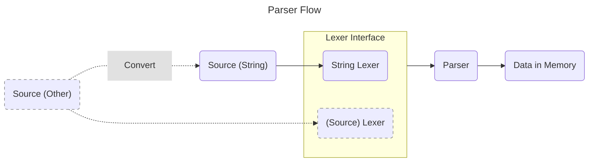

# KotlinJSONParser

KotlinJSONParser is a simple and lightweight JSON parser written in Kotlin. It allows you to easily parse JSON strings into Kotlin objects.
This is mostly a toy project and with that less useful for normal usage. If you want to use a JSON parser, you should consider JSON parsers like [Jackson](https://github.com/FasterXML/jackson) or [Gson](https://github.com/google/gson).

This JSON parser is fully [JSON RFC](https://www.rfc-editor.org/rfc/rfc8259) compliant.

## Features

- Lightweight and easy to use
- Built with Kotlin
- Simple API
- No dependencies

## Parser Flow


> [!NOTE]
> Everything that is currently dashed is not being completely implemented and needs some extra work.

## Getting Started

### Prerequisites

- Kotlin
- Gradle

### Usage

Here's a simple example of how to use KotlinJSONParser:

```kotlin
val jsonString = """{"name": "John", "age": 30}"""
val json = jsonParse(jsonString)

println(json["name"]) // Output: John
println(json["age"])  // Output: 30
```

If a different input type is being wanted a Lexer that implements [JSONLexer](src/main/kotlin/lexer/JSONLexer.kt) can be provided:

```kotlin
val jsonString = """{"name": "John", "age": 30}"""
val json = jsonParse(StringJSONLexer(jsonString))
//                   ^ Implements the JSONLexer interface

println(json["name"]) // Output: John
println(json["age"])  // Output: 30
```

The `JSONLexer` interface requires two methods:
1. `getNext()` -> Returns the next token from the input.

   If the input has ended it will provide an `EOF Token`.
2. `getPosition(position, length):` -> Returns some specific position data for error handling.

### The `jsonParse` function

The `jsonParse` function returns these Datatypes:
- Boolean
- String
- (Null)
- BigDecimal
- List
- Map

## More information
If you want to know more about the project and how it works, check out the [wiki](https://github.com/QuickWrite/KotlinJsonParser/wiki).

Or otherwise just check out the source code. :smile:

## License
This project is licensed under the Apache 2.0 License - see the [LICENSE](LICENSE) file for details.
